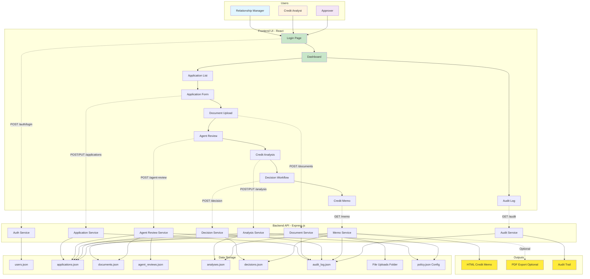
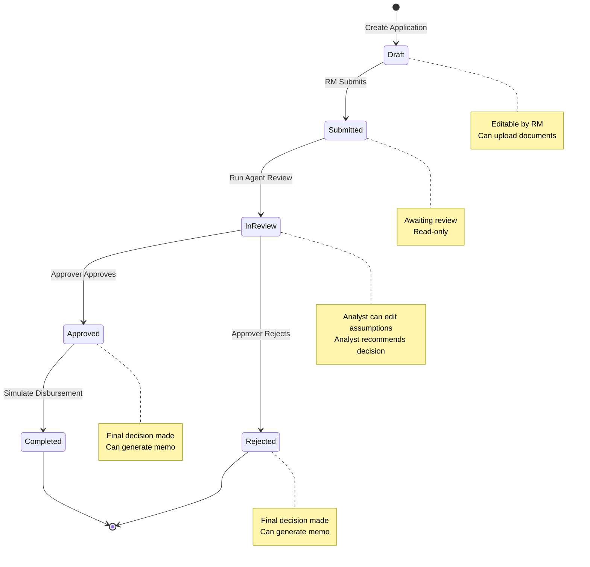

# Loan Origination System (LOS) - Architecture Documentation

## Overview
This document provides comprehensive architecture diagrams for the LOS MVP application, showing both the end-to-end flow and technology stack.

---

## A) End-to-End Flow Diagram

This diagram shows the complete user journey from login through application processing to credit memo generation.



---

## B) Technology Stack & Architecture View

This diagram shows the complete technology stack and how components interact.

```mermaid
graph TB
    subgraph "Client Layer - Browser"
        BROWSER[Web Browser]
        subgraph "Frontend - React 18 + Vite"
            REACT[React Components]
            ROUTER[React Router v6]
            CONTEXT[Context API]
            AXIOS[Axios HTTP Client]
        end
    end

    subgraph "API Layer - Node.js"
        subgraph "Backend - Express.js"
            SERVER[Express Server :3001]
            ROUTES[REST API Routes]
            MIDDLEWARE[Middleware]
            SERVICES[Business Logic Services]
        end
    end

    subgraph "Storage Layer - File System"
        subgraph "JSON Data Store"
            JSON_DB[(JSON Files)]
            USER_DATA[users.json]
            APP_DATA[applications.json]
            DOC_META[documents.json]
            REVIEW_DATA[agent_reviews.json]
            ANALYSIS_DATA[analyses.json]
            DECISION_DATA[decisions.json]
            AUDIT_DATA[audit_log.json]
        end
        
        subgraph "File Storage"
            FILE_SYS[Local File System]
            UPLOAD_DIR[/data/uploads/]
        end
        
        subgraph "Configuration"
            CONFIG[policy.json]
        end
    end

    subgraph "Core Features"
        subgraph "Authentication & Authorization"
            JWT[JWT Tokens]
            RBAC[Role-Based Access Control]
        end
        
        subgraph "Agent Review Engine"
            EXTRACT[Document Field Extraction]
            VALIDATE[Data Quality Validation]
            RISK[Risk Flag Detection]
            RECOMMEND[Decision Recommendation]
        end
        
        subgraph "Credit Analysis Engine"
            DSCR[DSCR Calculation]
            CASHFLOW[Cashflow Analysis]
            COLLATERAL[Collateral Coverage]
            RISK_SCORE[Risk Scoring]
        end
        
        subgraph "Decision Engine"
            POLICY_CHECK[Policy Threshold Check]
            WORKFLOW[Status Workflow]
            APPROVAL[Approval Logic]
        end
        
        subgraph "Export & Reporting"
            MEMO_GEN[Credit Memo Generator]
            HTML_EXPORT[HTML Export]
            PDF_EXPORT[PDF Export Optional]
        end
        
        subgraph "Audit System"
            AUDIT_LOG[Audit Logger]
            TRAIL[Complete Audit Trail]
        end
    end

    %% Client to API Flow
    BROWSER --> REACT
    REACT --> ROUTER
    REACT --> CONTEXT
    REACT --> AXIOS
    AXIOS -.->|HTTP/REST| SERVER

    %% API Internal Flow
    SERVER --> ROUTES
    ROUTES --> MIDDLEWARE
    MIDDLEWARE --> JWT
    MIDDLEWARE --> RBAC
    MIDDLEWARE --> SERVICES

    %% Services to Storage
    SERVICES --> JSON_DB
    SERVICES --> FILE_SYS
    SERVICES --> CONFIG

    %% JSON DB Details
    JSON_DB --> USER_DATA
    JSON_DB --> APP_DATA
    JSON_DB --> DOC_META
    JSON_DB --> REVIEW_DATA
    JSON_DB --> ANALYSIS_DATA
    JSON_DB --> DECISION_DATA
    JSON_DB --> AUDIT_DATA

    %% File Storage Details
    FILE_SYS --> UPLOAD_DIR

    %% Feature Integration
    SERVICES --> EXTRACT
    SERVICES --> VALIDATE
    SERVICES --> RISK
    SERVICES --> RECOMMEND
    SERVICES --> DSCR
    SERVICES --> CASHFLOW
    SERVICES --> COLLATERAL
    SERVICES --> RISK_SCORE
    SERVICES --> POLICY_CHECK
    SERVICES --> WORKFLOW
    SERVICES --> APPROVAL
    SERVICES --> MEMO_GEN
    SERVICES --> AUDIT_LOG

    %% Outputs
    MEMO_GEN --> HTML_EXPORT
    MEMO_GEN -.->|Optional| PDF_EXPORT
    AUDIT_LOG --> TRAIL

    style BROWSER fill:#e3f2fd
    style REACT fill:#c8e6c9
    style SERVER fill:#fff9c4
    style JSON_DB fill:#f8bbd0
    style FILE_SYS fill:#f8bbd0
    style JWT fill:#b2dfdb
    style RBAC fill:#b2dfdb
    style EXTRACT fill:#ffccbc
    style DSCR fill:#d1c4e9
    style POLICY_CHECK fill:#c5cae9
    style MEMO_GEN fill:#ffe0b2
    style AUDIT_LOG fill:#ffccbc
```



---

## Technology Stack Details

### Frontend Stack
- **Framework:** React 18.3.1
- **Build Tool:** Vite 5.4.2
- **Routing:** React Router v6.26.1
- **HTTP Client:** Axios 1.7.7
- **State Management:** React Context API
- **Styling:** CSS3 with custom styles

### Backend Stack
- **Runtime:** Node.js
- **Framework:** Express.js 4.19.2
- **Authentication:** JWT (jsonwebtoken 9.0.2)
- **Validation:** express-validator 7.2.0
- **File Upload:** Multer 1.4.5-lts.1
- **Utilities:** uuid 10.0.0, bcryptjs 2.4.3

### Storage Stack
- **Primary Storage:** JSON files (file-based database)
- **File Storage:** Local file system
- **Configuration:** JSON config files

### Key Features Implementation

#### 1. Authentication & Authorization
- JWT-based authentication
- Role-based access control (RM, Credit Analyst, Approver, Admin)
- Protected routes and API endpoints

#### 2. Agent Review Engine
- Automated document field extraction (mocked for MVP)
- Data quality validation
- Risk flag detection
- Decision recommendation logic

#### 3. Credit Analysis Engine
- DSCR (Debt Service Coverage Ratio) calculation
- Net Operating Cashflow analysis
- Collateral coverage calculation
- Risk scoring (0-100 scale)

#### 4. Decision Engine
- Policy threshold validation
- Status workflow management
- Multi-level approval process

#### 5. Export & Reporting
- HTML credit memo generation
- Complete audit trail
- PDF export capability (optional)

#### 6. Audit System
- Comprehensive action logging
- Before/after state tracking
- Complete audit trail for compliance

---

## Data Flow Patterns

### 1. Application Creation Flow
```
RM → Create Form → Submit → Application Service → applications.json → Audit Log
```

### 2. Document Upload Flow
```
RM → Upload File → Multer → File System → Document Service → documents.json → Audit Log
```

### 3. Agent Review Flow
```
User → Trigger Review → Agent Service → Read Docs/App → Policy Check → Generate Review → agent_reviews.json
```

### 4. Credit Analysis Flow
```
Analyst → View Analysis → Analysis Service → Calculate Metrics → analyses.json → Update Status
```

### 5. Decision Flow
```
Analyst → Recommend → Decision Service → decisions.json → 
Approver → Finalize → Update Status → Audit Log
```

### 6. Credit Memo Flow
```
User → Generate Memo → Memo Service → Read All Data → Generate HTML → Return to UI
```

---

## Security Architecture

### Authentication Flow
1. User submits credentials
2. Backend validates against users.json
3. JWT token generated with user info + role
4. Token stored in localStorage
5. Token sent in Authorization header for all requests
6. Backend validates token on each request

### Authorization Flow
1. Middleware extracts JWT token
2. Verifies token signature
3. Extracts user role
4. Checks role against route requirements
5. Allows/denies access based on RBAC rules

### File Upload Security
1. File type validation (PDF, JPG, PNG, DOCX only)
2. File size limit (10MB)
3. Unique filename generation (UUID)
4. Secure storage path
5. Access control via API

---

## Scalability Considerations

### Current MVP Limitations
- File-based storage (not suitable for production)
- No concurrent access handling
- Limited to single server instance
- No caching layer

### Future Production Recommendations
1. **Database:** Migrate to PostgreSQL or MongoDB
2. **File Storage:** Use cloud storage (S3, Azure Blob)
3. **Caching:** Implement Redis for session/data caching
4. **Load Balancing:** Add load balancer for multiple instances
5. **Message Queue:** Add queue for async processing
6. **Monitoring:** Implement logging and monitoring tools

---

## Deployment Architecture (MVP)

```mermaid
graph LR
    subgraph "Development Environment"
        DEV[Developer Machine]
        subgraph "Frontend Dev Server"
            VITE[Vite Dev Server :5173]
        end
        subgraph "Backend Dev Server"
            NODE[Node.js Server :3001]
        end
        subgraph "Local Storage"
            DATA[/data folder]
        end
    end

    DEV --> VITE
    DEV --> NODE
    VITE -.->|API Calls| NODE
    NODE --> DATA

    style VITE fill:#c8e6c9
    style NODE fill:#fff9c4
    style DATA fill:#f8bbd0
```

### Running the Application

**Backend:**
```bash
cd backend
npm install
npm start
# Server runs on http://localhost:3001
```

**Frontend:**
```bash
cd frontend
npm install
npm run dev
# UI runs on http://localhost:5173
```

---

## API Architecture

### REST API Endpoints Structure

```
/api
├── /auth
│   ├── POST /login
│   ├── POST /logout
│   ├── GET /me
│   └── GET /users
├── /applications
│   ├── GET /
│   ├── POST /
│   ├── GET /:id
│   ├── PUT /:id
│   ├── DELETE /:id
│   ├── POST /:id/submit
│   ├── POST /:id/complete
│   ├── GET /:id/documents
│   ├── POST /:id/documents
│   ├── GET /:id/documents/checklist
│   ├── POST /:id/agent-review
│   ├── GET /:id/agent-review
│   ├── POST /:id/analysis
│   ├── GET /:id/analysis
│   ├── PUT /:id/analysis/assumptions
│   ├── POST /:id/decision/recommend
│   ├── POST /:id/decision/finalize
│   ├── GET /:id/decision
│   ├── GET /:id/memo
│   └── GET /:id/audit
├── /documents
│   ├── GET /:id
│   ├── GET /:id/download
│   └── DELETE /:id
├── /audit
│   └── GET /
└── /config
    ├── GET /policy
    └── PUT /policy
```

---

## Component Architecture

### Frontend Component Hierarchy

```
App
├── AuthContext Provider
├── ToastContext Provider
└── Router
    ├── Login
    └── Layout (Protected)
        ├── Dashboard
        ├── ApplicationList
        ├── ApplicationForm
        ├── ApplicationDetail
        ├── DocumentUpload
        ├── AgentReview
        ├── CreditAnalysis
        ├── DecisionWorkflow
        ├── CreditMemo
        └── AuditLog
```

### Backend Service Architecture

```
Server
├── Middleware
│   ├── Authentication (JWT)
│   └── Authorization (RBAC)
├── Routes
│   ├── Auth Routes
│   ├── Application Routes
│   ├── Document Routes
│   ├── Audit Routes
│   └── Config Routes
└── Services
    ├── Auth Service
    ├── Application Service
    ├── Document Service
    ├── Agent Review Service
    ├── Analysis Service
    ├── Decision Service
    ├── Memo Service
    └── Audit Service
```

---

## Status Workflow Architecture



---

## Audit Trail Architecture

Every action in the system is logged with:
- **Timestamp:** When the action occurred
- **Actor:** Who performed the action (user ID + name)
- **Action:** What was done (create, update, delete, submit, approve, etc.)
- **Entity Type:** What was affected (application, document, analysis, etc.)
- **Entity ID:** Specific record affected
- **Before/After:** State changes (for updates)

This ensures complete traceability and compliance with audit requirements.

---

*This architecture documentation reflects the current MVP implementation and provides guidance for future enhancements.*