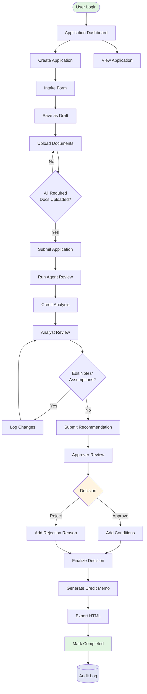
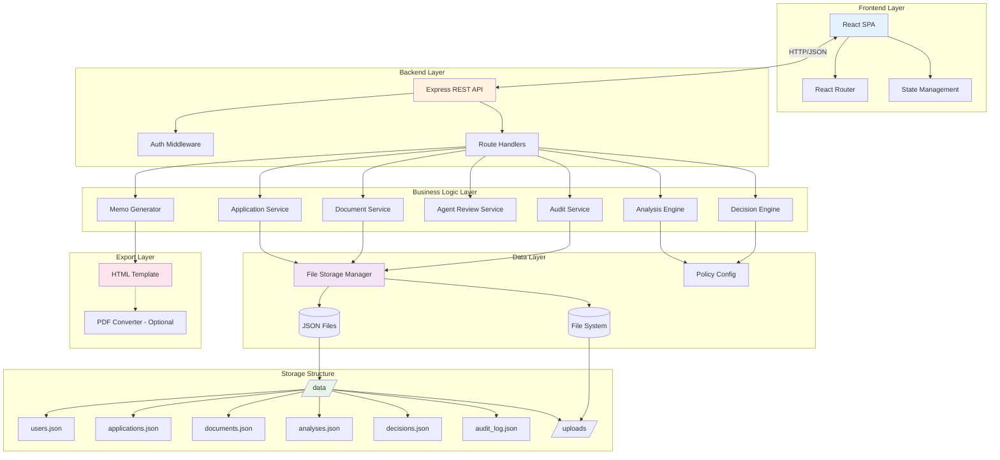
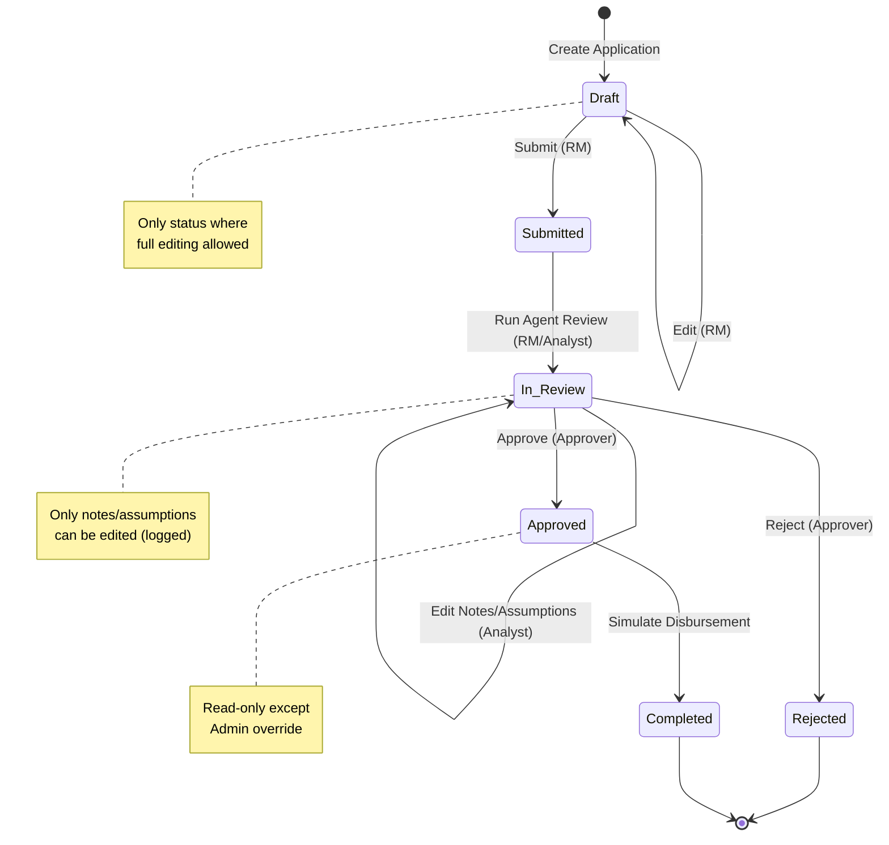

# Loan Origination System (LOS) - MVP Implementation Plan

## 1) SCOPE SUMMARY

### What We Will Build
A demo-ready web application for processing SME loan applications in the Philippines with:
- **End-to-end workflow**: Application intake → Document upload → Automated credit analysis → Decision approval → Credit memo generation
- **Role-based access**: RM, Credit Analyst, Approver, Admin
- **File-based persistence**: No database required (JSON files)
- **Complete audit trail**: All actions logged with before/after states
- **Credit analysis engine**: DSCR, cashflow, collateral coverage, risk scoring
- **Policy-driven decisions**: Configurable business rules
- **Document management**: Upload, track, and analyze required documents
- **Credit memo export**: HTML format (PDF optional)

### Key Constraints
- **No database**: Use local JSON file storage
- **No external integrations**: Simulate all external services
- **Demo-focused**: Seed data with realistic variations
- **Audit everything**: Complete traceability of all actions

---

## 2) MVP PHASES

### Phase 1: CORE MVP (Must Have)
**Priority: P0 - Required for demo**

#### Backend Foundation
- [ ] Project setup (Node.js + Express)
- [ ] File-based storage layer (JSON persistence)
- [ ] User authentication (hardcoded users)
- [ ] Audit logging system
- [ ] Policy configuration loader

#### Application Management
- [ ] Application CRUD operations
- [ ] Status workflow enforcement
- [ ] Field validation
- [ ] Application list with search/filter

#### Document Management
- [ ] Document upload endpoint
- [ ] File storage structure
- [ ] Document metadata tracking
- [ ] Required docs checklist

#### Credit Analysis Engine
- [ ] DSCR calculation
- [ ] Cashflow computation
- [ ] Collateral coverage analysis
- [ ] Risk score calculation (0-100)
- [ ] Policy rule evaluation

#### Agent Review System
- [ ] Mock document field extraction
- [ ] Missing document detection
- [ ] Data quality validation
- [ ] Risk flag generation
- [ ] Decision recommendation logic

#### Decision & Approval
- [ ] Analyst recommendation workflow
- [ ] Approver decision workflow
- [ ] Conditions management
- [ ] Read-only enforcement after approval

#### Credit Memo Generation
- [ ] HTML template engine
- [ ] Memo data compilation
- [ ] HTML export functionality

#### Frontend (React)
- [ ] Login page
- [ ] Application list page
- [ ] Application intake form
- [ ] Document upload interface
- [ ] Agent review display
- [ ] Credit analysis view
- [ ] Decision/approval interface
- [ ] Credit memo viewer
- [ ] Audit log viewer

#### Demo Data
- [ ] Seed data generator script
- [ ] 10-30 sample applications
- [ ] Varied scenarios (approve/review/reject)
- [ ] Mock document metadata

### Phase 2: NICE-TO-HAVE (Enhanced Demo)
**Priority: P1 - Improves demo quality**

- [ ] PDF export for credit memo
- [ ] Advanced search filters
- [ ] Dashboard with statistics
- [ ] Document preview (images/PDFs)
- [ ] Bulk operations
- [ ] Export audit log to CSV
- [ ] Email notifications (simulated)
- [ ] Application templates
- [ ] Collateral valuation calculator
- [ ] Industry-specific risk profiles

### Phase 3: OPTIONAL (Future Enhancements)
**Priority: P2 - Post-MVP**

- [ ] Admin panel for policy management
- [ ] User management UI
- [ ] Real document OCR integration
- [ ] Advanced analytics dashboard
- [ ] Workflow customization
- [ ] Multi-language support
- [ ] Mobile responsive optimization
- [ ] Real-time collaboration features
- [ ] Integration APIs for external systems
- [ ] Advanced reporting

---

## 3) ARCHITECTURE DIAGRAMS

### A) End-to-End Flow Diagram



### B) Technology Architecture



---

## 4) DESIGN SPECIFICATIONS

### 4.1 Data Model

#### User
```json
{
  "id": "string (UUID)",
  "username": "string",
  "password": "string (hashed)",
  "name": "string",
  "role": "RM | Credit Analyst | Approver | Admin",
  "email": "string",
  "created_at": "ISO timestamp"
}
```

#### Application
```json
{
  "id": "string (UUID)",
  "application_number": "string (e.g., APP-2024-001)",
  "status": "Draft | Submitted | In Review | Approved | Rejected | Completed",
  "owner_user_id": "string (UUID)",
  
  "applicant": {
    "legal_name": "string",
    "business_type": "Sole Proprietorship | Partnership | Corporation",
    "industry": "string",
    "years_in_business": "number"
  },
  
  "loan_request": {
    "amount": "number",
    "tenor_months": "number",
    "purpose": "string",
    "repayment_type": "Monthly | Quarterly | Bullet"
  },
  
  "financial_snapshot": {
    "monthly_revenue": "number",
    "monthly_expenses": "number",
    "existing_debt_payment": "number"
  },
  
  "collateral": {
    "type": "Real Estate | Equipment | Inventory | Receivables | Other",
    "estimated_value": "number"
  },
  
  "owner_info": {
    "name": "string",
    "id_number": "string",
    "credit_score": "number (mock)"
  },
  
  "created_at": "ISO timestamp",
  "updated_at": "ISO timestamp",
  "submitted_at": "ISO timestamp | null",
  "completed_at": "ISO timestamp | null"
}
```

#### Document
```json
{
  "id": "string (UUID)",
  "application_id": "string (UUID)",
  "doc_type": "Bank Statement | Financial Statement | ID/KYC | Collateral Proof | Other",
  "filename": "string",
  "storage_path": "string",
  "file_size": "number (bytes)",
  "uploaded_by": "string (user_id)",
  "uploaded_at": "ISO timestamp",
  "extracted_fields": {
    "key": "value (flexible JSON)"
  }
}
```

#### Analysis
```json
{
  "id": "string (UUID)",
  "application_id": "string (UUID)",
  "dscr": "number",
  "net_cashflow": "number",
  "collateral_coverage": "number (percentage)",
  "risk_score": "number (0-100)",
  "flags": [
    {
      "type": "string",
      "severity": "High | Medium | Low",
      "message": "string"
    }
  ],
  "assumptions": {
    "key": "value (editable by analyst)"
  },
  "notes": "string",
  "created_by": "string (user_id)",
  "created_at": "ISO timestamp",
  "updated_at": "ISO timestamp"
}
```

#### Decision
```json
{
  "id": "string (UUID)",
  "application_id": "string (UUID)",
  "recommended_by": "string (user_id - analyst)",
  "recommended_decision": "Approve | Reject | Need More Info",
  "recommendation_notes": "string",
  "recommended_at": "ISO timestamp",
  
  "approver_id": "string (user_id)",
  "final_decision": "Approved | Rejected",
  "conditions": [
    {
      "condition": "string",
      "type": "Pre-disbursement | Post-disbursement"
    }
  ],
  "rejection_reason": "string | null",
  "decided_at": "ISO timestamp",
  "is_final": "boolean"
}
```

#### AuditLog
```json
{
  "id": "string (UUID)",
  "timestamp": "ISO timestamp",
  "actor_id": "string (user_id)",
  "actor_name": "string",
  "action": "string (e.g., CREATE_APPLICATION, UPLOAD_DOCUMENT)",
  "entity_type": "Application | Document | Analysis | Decision",
  "entity_id": "string (UUID)",
  "before": "object | null",
  "after": "object | null",
  "metadata": {
    "ip_address": "string",
    "user_agent": "string"
  }
}
```

### 4.2 API Endpoints

#### Authentication
- `POST /api/auth/login` - User login
- `POST /api/auth/logout` - User logout
- `GET /api/auth/me` - Get current user

#### Applications
- `GET /api/applications` - List applications (with filters)
- `GET /api/applications/:id` - Get application details
- `POST /api/applications` - Create new application
- `PUT /api/applications/:id` - Update application (status-dependent)
- `DELETE /api/applications/:id` - Delete application (Draft only)
- `POST /api/applications/:id/submit` - Submit application
- `POST /api/applications/:id/complete` - Mark as completed

#### Documents
- `GET /api/applications/:id/documents` - List documents for application
- `POST /api/applications/:id/documents` - Upload document
- `GET /api/documents/:id` - Get document metadata
- `GET /api/documents/:id/download` - Download document file
- `DELETE /api/documents/:id` - Delete document
- `GET /api/applications/:id/documents/checklist` - Get required docs checklist

#### Agent Review
- `POST /api/applications/:id/agent-review` - Run agent review
- `GET /api/applications/:id/agent-review` - Get latest review results

#### Analysis
- `GET /api/applications/:id/analysis` - Get credit analysis
- `POST /api/applications/:id/analysis` - Create/update analysis
- `PUT /api/applications/:id/analysis/assumptions` - Update assumptions/notes

#### Decision
- `GET /api/applications/:id/decision` - Get decision details
- `POST /api/applications/:id/decision/recommend` - Submit analyst recommendation
- `POST /api/applications/:id/decision/approve` - Approver final decision

#### Credit Memo
- `GET /api/applications/:id/memo` - Generate and return HTML memo
- `GET /api/applications/:id/memo/pdf` - Generate PDF (optional)

#### Audit Log
- `GET /api/audit-log` - Get audit log entries (with filters)
- `GET /api/audit-log/application/:id` - Get audit log for specific application

#### Configuration
- `GET /api/config/policy` - Get policy thresholds
- `PUT /api/config/policy` - Update policy thresholds (Admin only)

### 4.3 UI Pages

#### 1. Login Page (`/login`)
- Username/password form
- Hardcoded user selection for demo
- Role display after login

#### 2. Dashboard (`/dashboard`)
- Application statistics cards
- Recent applications list
- Quick actions (Create New, View All)

#### 3. Application List (`/applications`)
- Searchable/filterable table
- Columns: ID, Applicant, Product, Amount, Status, Last Updated, Owner
- Status filter dropdown
- Search by applicant name or ID
- Click row to view details

#### 4. Application Detail (`/applications/:id`)
- Tabbed interface:
  - **Overview**: Application summary
  - **Documents**: Upload and manage documents
  - **Analysis**: Credit analysis results
  - **Decision**: Recommendation and approval
  - **Memo**: Generated credit memo
  - **Audit**: Activity log for this application

#### 5. Create/Edit Application (`/applications/new` or `/applications/:id/edit`)
- Multi-section form:
  - Applicant Information
  - Loan Request Details
  - Financial Snapshot
  - Collateral Information
  - Owner Information
- Validation on all required fields
- Save as Draft button
- Submit button (when complete)

#### 6. Document Upload (`/applications/:id/documents`)
- Drag-and-drop upload area
- Document type selector
- Required documents checklist with completion %
- Document list with metadata
- Delete option for uploaded docs

#### 7. Agent Review (`/applications/:id/review`)
- "Run Agent Review" button
- Results display:
  - Extracted fields summary
  - Missing documents alert
  - Data quality warnings
  - Risk flags (top 3-5)
  - Recommended decision with reasoning
  - Suggested conditions

#### 8. Credit Analysis (`/applications/:id/analysis`)
- Financial metrics display:
  - DSCR with formula breakdown
  - Net Operating Cashflow
  - Collateral Coverage %
  - Risk Score (0-100) with gauge
- Editable assumptions section
- Analyst notes textarea
- Policy thresholds reference panel

#### 9. Decision & Approval (`/applications/:id/decision`)
- **Analyst Section**:
  - Recommendation dropdown (Approve/Reject/Need More Info)
  - Notes textarea
  - Submit Recommendation button
- **Approver Section**:
  - Final decision radio buttons
  - Conditions builder (for approval)
  - Rejection reason textarea
  - Finalize Decision button

#### 10. Credit Memo Viewer (`/applications/:id/memo`)
- Formatted HTML display
- Export to HTML button
- Export to PDF button (optional)
- Print button

#### 11. Audit Log Viewer (`/audit`)
- Filterable log table
- Columns: Timestamp, User, Action, Entity, Details
- Expandable rows for before/after JSON
- Export to CSV option
- Filter by date range, user, action type

#### 12. Admin Panel (`/admin`) - Optional
- Policy threshold configuration
- User management
- System statistics

### 4.4 RBAC & Status Flow

#### Role Permissions

| Action | RM | Credit Analyst | Approver | Admin |
|--------|----|--------------|---------|----|
| Create Application | ✓ | ✗ | ✗ | ✓ |
| Edit Draft | ✓ | ✗ | ✗ | ✓ |
| Upload Documents | ✓ | ✗ | ✗ | ✓ |
| Submit Application | ✓ | ✗ | ✗ | ✓ |
| Run Agent Review | ✓ | ✓ | ✗ | ✓ |
| View Analysis | ✓ | ✓ | ✓ | ✓ |
| Edit Assumptions/Notes | ✗ | ✓ | ✗ | ✓ |
| Submit Recommendation | ✗ | ✓ | ✗ | ✓ |
| Approve/Reject | ✗ | ✗ | ✓ | ✓ |
| Generate Memo | ✓ | ✓ | ✓ | ✓ |
| View Audit Log | ✓ | ✓ | ✓ | ✓ |
| Edit Policy Config | ✗ | ✗ | ✗ | ✓ |

#### Status Transition Rules



#### Field Edit Restrictions by Status

| Status | Editable Fields | Who Can Edit |
|--------|----------------|--------------|
| Draft | All fields | RM, Admin |
| Submitted | Notes only | RM, Admin |
| In Review | Analysis assumptions, notes | Credit Analyst, Admin |
| Approved | None (read-only) | Admin only (override) |
| Rejected | None (read-only) | Admin only (override) |
| Completed | None (read-only) | Admin only (override) |

---

## 5) MODULE BUILD STEPS

### Backend Modules (Node.js + Express)

#### Module 1: Project Setup & Core Infrastructure
1. Initialize Node.js project with Express
2. Set up project structure:
   ```
   /backend
     /src
       /config
       /middleware
       /routes
       /services
       /utils
       /models (TypeScript interfaces)
     /data
       /uploads
     server.js
   ```
3. Install dependencies: express, cors, multer, uuid, dotenv
4. Create file storage manager utility
5. Set up error handling middleware
6. Configure CORS and body parsing

#### Module 2: Authentication & User Management
1. Create user service with hardcoded users
2. Implement login endpoint with session/JWT
3. Create auth middleware for protected routes
4. Add role-based access control (RBAC) middleware
5. Implement current user endpoint

#### Module 3: Application Management
1. Create application service (CRUD operations)
2. Implement application routes
3. Add status validation logic
4. Create application list with filters
5. Implement field validation
6. Add status transition enforcement

#### Module 4: Document Management
1. Create document service
2. Set up multer for file uploads
3. Implement document upload endpoint
4. Create document metadata storage
5. Add required docs checklist logic
6. Implement document download endpoint

#### Module 5: Agent Review Engine
1. Create agent review service
2. Implement mock field extraction
3. Add missing document detection
4. Create data quality validation rules
5. Implement risk flag generation
6. Build decision recommendation logic

#### Module 6: Credit Analysis Engine
1. Create analysis service
2. Implement DSCR calculation
3. Add cashflow computation
4. Create collateral coverage calculator
5. Implement risk score algorithm
6. Add assumptions/notes management

#### Module 7: Decision & Approval
1. Create decision service
2. Implement analyst recommendation endpoint
3. Add approver decision endpoint
4. Create conditions management
5. Implement read-only enforcement
6. Add decision validation

#### Module 8: Credit Memo Generation
1. Create memo generator service
2. Design HTML template
3. Implement data compilation logic
4. Add HTML export endpoint
5. (Optional) Add PDF generation

#### Module 9: Audit Logging
1. Create audit service
2. Implement audit log middleware
3. Add before/after state capture
4. Create audit log query endpoint
5. Implement audit log filtering

#### Module 10: Policy Configuration
1. Create policy config loader
2. Implement policy validation
3. Add policy update endpoint (Admin)
4. Create default policy file

### Frontend Modules (React)

#### Module 1: Project Setup & Routing
1. Initialize React app (Vite or Create React App)
2. Set up React Router
3. Install dependencies: axios, react-router-dom, date-fns
4. Create project structure:
   ```
   /frontend
     /src
       /components
       /pages
       /services
       /utils
       /context
       App.jsx
   ```
5. Set up API client utility

#### Module 2: Authentication & Layout
1. Create login page
2. Implement auth context/provider
3. Create protected route component
4. Build main layout with navigation
5. Add user profile display

#### Module 3: Application List & Dashboard
1. Create dashboard page
2. Build application list component
3. Implement search and filter
4. Add status badges
5. Create application card component

#### Module 4: Application Forms
1. Create application intake form
2. Implement form validation
3. Add multi-section layout
4. Create reusable form components
5. Implement save and submit logic

#### Module 5: Document Management UI
1. Create document upload component
2. Implement drag-and-drop
3. Build required docs checklist
4. Add document list display
5. Implement delete functionality

#### Module 6: Agent Review Display
1. Create agent review page
2. Build review results display
3. Add risk flags visualization
4. Create recommendation display
5. Implement "Run Review" button

#### Module 7: Credit Analysis UI
1. Create analysis page
2. Build metrics display cards
3. Add DSCR breakdown visualization
4. Create risk score gauge
5. Implement editable assumptions form

#### Module 8: Decision & Approval UI
1. Create decision page
2. Build analyst recommendation form
3. Add approver decision interface
4. Create conditions builder
5. Implement decision confirmation

#### Module 9: Credit Memo Viewer
1. Create memo viewer page
2. Implement HTML rendering
3. Add export buttons
4. Create print functionality

#### Module 10: Audit Log Viewer
1. Create audit log page
2. Build log table component
3. Implement filtering
4. Add expandable row details
5. Create export functionality

---

## 6) DELIVERABLES CHECKLIST

### Core Application
- [ ] Working web application (frontend + backend)
- [ ] User authentication system
- [ ] Application management (CRUD)
- [ ] Document upload and management
- [ ] Agent review functionality
- [ ] Credit analysis engine
- [ ] Decision and approval workflow
- [ ] Credit memo generation (HTML)
- [ ] Audit logging system

### Data & Storage
- [ ] File storage structure (`/data` folder)
- [ ] JSON persistence layer
- [ ] Policy configuration file
- [ ] Uploaded documents storage

### Demo Data
- [ ] Seed data generator script
- [ ] 10-30 sample applications
- [ ] Varied scenarios (approve/review/reject)
- [ ] Mock document metadata
- [ ] Hardcoded demo users

### Documentation
- [ ] README.md with:
  - [ ] Installation instructions
  - [ ] How to run locally
  - [ ] Demo walkthrough steps
  - [ ] User credentials
  - [ ] API documentation
- [ ] Architecture documentation (this file)
- [ ] Policy configuration guide

### Templates & Assets
- [ ] Credit memo HTML template
- [ ] Email templates (if simulated)
- [ ] UI mockups/wireframes (optional)

---

## 7) TECHNOLOGY STACK

### Backend
- **Runtime**: Node.js (v18+)
- **Framework**: Express.js
- **File Upload**: Multer
- **UUID Generation**: uuid
- **Date Handling**: date-fns
- **Validation**: express-validator

### Frontend
- **Framework**: React (v18+)
- **Build Tool**: Vite
- **Routing**: React Router v6
- **HTTP Client**: Axios
- **Styling**: Tailwind CSS or Material-UI
- **Date Handling**: date-fns
- **Charts**: Recharts (for risk score gauge)

### Storage
- **Data**: JSON files
- **Documents**: Local file system
- **Configuration**: JSON config file

### Development Tools
- **Version Control**: Git
- **Code Editor**: VS Code
- **API Testing**: Postman or Thunder Client
- **Package Manager**: npm or yarn

---

## 8) ASSUMPTIONS & DECISIONS

### Assumptions Made
1. **Currency**: All amounts in Philippine Peso (PHP)
2. **Date Format**: ISO 8601 timestamps
3. **File Size Limits**: Max 10MB per document upload
4. **Session Management**: JWT tokens with 24-hour expiry
5. **Concurrent Users**: Single-user demo (no real-time sync needed)
6. **Browser Support**: Modern browsers (Chrome, Firefox, Safari, Edge)
7. **Document Types**: Accept PDF, JPG, PNG, DOCX
8. **Risk Score Algorithm**: Weighted average of DSCR, credit score, years in business, collateral coverage
9. **Agent Review**: Mock extraction (no real OCR/AI)
10. **Disbursement**: Simulated (just status change)

### Design Decisions
1. **No Database**: Use JSON files for simplicity and portability
2. **Monorepo Structure**: Keep frontend and backend in same repo
3. **RESTful API**: Standard REST endpoints (no GraphQL)
4. **Stateless Backend**: JWT-based auth (no server sessions)
5. **Optimistic UI**: Update UI immediately, rollback on error
6. **Audit Everything**: Log all state changes automatically
7. **Read-Only After Approval**: Prevent tampering with approved decisions
8. **Policy-Driven**: All business rules in config file
9. **HTML-First Export**: HTML memo required, PDF optional
10. **Demo-Focused**: Prioritize demo flow over production features

---

## 9) RISK MITIGATION

### Technical Risks
| Risk | Impact | Mitigation |
|------|--------|-----------|
| File corruption | High | Implement atomic writes, backup before updates |
| Concurrent file access | Medium | Use file locking or queue writes |
| Large file uploads | Medium | Implement file size limits, chunked uploads |
| Memory leaks | Low | Proper cleanup, avoid global state |
| Browser compatibility | Low | Use polyfills, test on major browsers |

### Demo Risks
| Risk | Impact | Mitigation |
|------|--------|-----------|
| Data loss during demo | High | Provide reset script, backup seed data |
| Slow performance | Medium | Optimize file reads, cache frequently accessed data |
| Confusing UI | Medium | User testing, clear labels, tooltips |
| Missing features | Low | Prioritize MVP features, document limitations |

---

## 10) SUCCESS CRITERIA

### Functional Requirements Met
- ✓ Complete loan application workflow (intake to disbursement)
- ✓ Role-based access control working
- ✓ Document upload and tracking functional
- ✓ Agent review generates meaningful output
- ✓ Credit analysis calculations accurate
- ✓ Decision workflow enforces business rules
- ✓ Credit memo exports correctly
- ✓ Audit log captures all actions

### Demo Quality
- ✓ Application runs without errors
- ✓ UI is clean and intuitive
- ✓ Seed data demonstrates all scenarios
- ✓ Demo can be completed in 10-15 minutes
- ✓ All features accessible and working

### Documentation Quality
- ✓ README provides clear setup instructions
- ✓ Demo walkthrough is easy to follow
- ✓ Code is commented where necessary
- ✓ Architecture is documented

---

## 11) NEXT STEPS

1. **Review and Approve Plan**: Get stakeholder sign-off on this plan
2. **Set Up Development Environment**: Initialize repos, install tools
3. **Start Backend Development**: Begin with Module 1 (Project Setup)
4. **Parallel Frontend Setup**: Initialize React app while backend progresses
5. **Iterative Development**: Build and test each module incrementally
6. **Integration Testing**: Test end-to-end workflow
7. **Seed Data Generation**: Create realistic demo data
8. **Demo Preparation**: Practice demo flow, fix issues
9. **Documentation**: Write README and guides
10. **Final Review**: QA testing, polish UI, verify all requirements met

---

**Plan Version**: 1.0  
**Last Updated**: 2026-03-12  
**Status**: Ready for Implementation