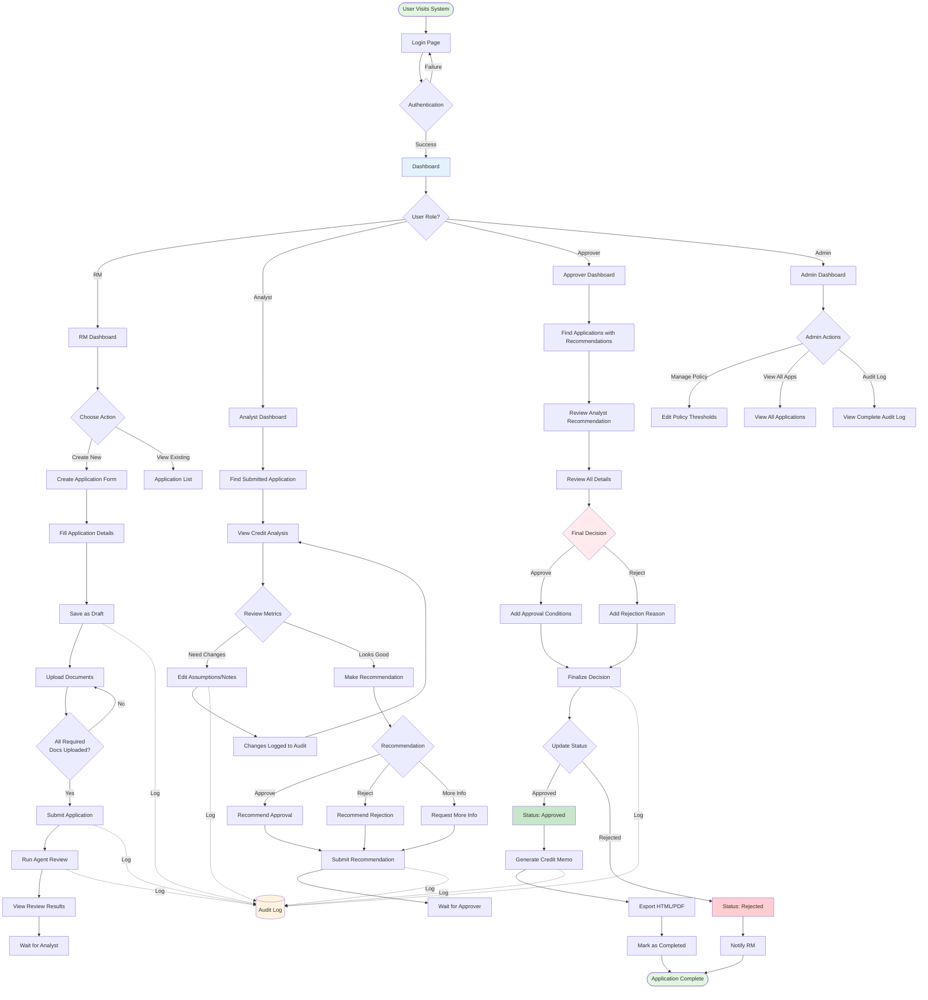
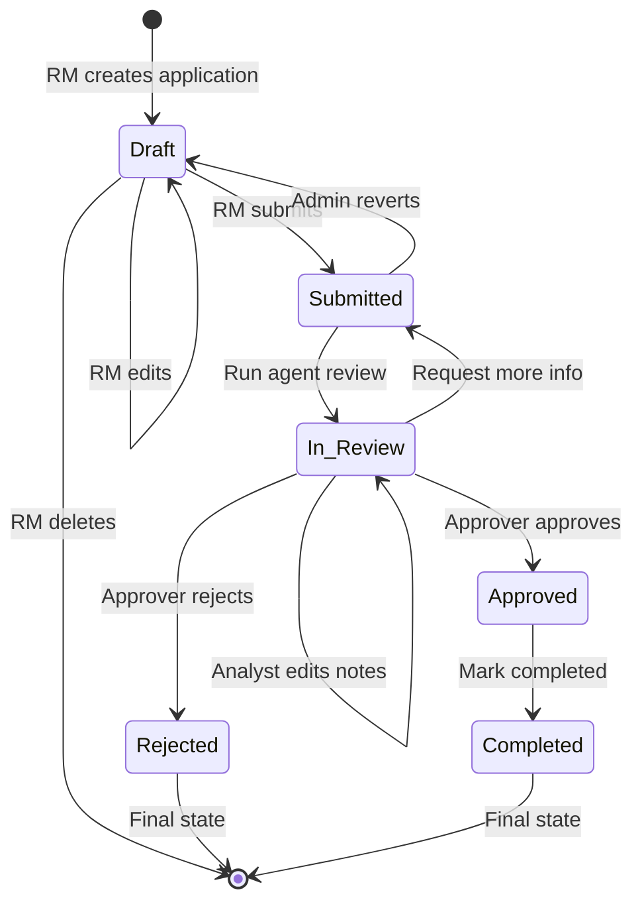

# Loan Origination System - Comprehensive User Flow

## Overview
This document provides detailed user flows for all roles in the Loan Origination System (LOS), showing step-by-step interactions from login to completion.

---

## 1. User Roles & Access Matrix

### Role Definitions
| Role | Primary Responsibility | Key Actions |
|------|----------------------|-------------|
| **RM (Relationship Manager)** | Application intake & submission | Create, edit drafts, upload documents, submit applications |
| **Credit Analyst** | Credit analysis & recommendation | Review analysis, edit assumptions, submit recommendations |
| **Approver** | Final decision making | Approve/reject applications, add conditions |
| **Admin** | System configuration | All actions + policy management |

### Access Control Matrix
| Feature | RM | Analyst | Approver | Admin |
|---------|-------|---------|----------|-------|
| Create Application | ✓ | ✗ | ✗ | ✓ |
| Edit Draft | ✓ | ✗ | ✗ | ✓ |
| Upload Documents | ✓ | ✗ | ✗ | ✓ |
| Submit Application | ✓ | ✗ | ✗ | ✓ |
| Run Agent Review | ✓ | ✓ | ✗ | ✓ |
| View Analysis | ✓ | ✓ | ✓ | ✓ |
| Edit Assumptions | ✗ | ✓ | ✗ | ✓ |
| Submit Recommendation | ✗ | ✓ | ✗ | ✓ |
| Approve/Reject | ✗ | ✗ | ✓ | ✓ |
| Generate Memo | ✓ | ✓ | ✓ | ✓ |
| View Audit Log | ✓ | ✓ | ✓ | ✓ |
| Edit Policy Config | ✗ | ✗ | ✗ | ✓ |

---

## 2. Complete User Flow Diagram



---

## 3. RM (Relationship Manager) Journey

### Journey 1: Create New Application (Happy Path)
**Duration**: 15-20 minutes

**Step 1: Login**
- Navigate to http://localhost:5173
- Enter credentials: `rm1` / `password123`
- Click "Login"

**Step 2: Access Dashboard**
- View application statistics
- See recent applications
- Click "Create New Application"

**Step 3: Fill Application Form**

*Section 1: Applicant Information*
- Legal Name: "ABC Manufacturing Corp"
- Business Type: "Corporation"
- Industry: "Manufacturing"
- Years in Business: 5

*Section 2: Loan Request*
- Amount: ₱2,000,000
- Tenor: 36 months
- Purpose: "Equipment Purchase"
- Repayment Type: "Monthly"

*Section 3: Financial Snapshot*
- Monthly Revenue: ₱500,000
- Monthly Expenses: ₱350,000
- Existing Debt Payment: ₱50,000

*Section 4: Collateral*
- Type: "Equipment"
- Estimated Value: ₱3,000,000

*Section 5: Owner Information*
- Name: "Juan Dela Cruz"
- ID Number: "123-456-789"
- Credit Score: 720

**Step 4: Save as Draft**
- Click "Save as Draft"
- System generates Application ID: APP-2024-001
- Status: Draft
- Audit log entry created

**Step 5: Upload Documents**
- Navigate to "Documents" tab
- Upload Bank Statement (PDF, 2MB)
- Upload Financial Statement (PDF, 1.5MB)
- Upload ID/KYC (JPG, 500KB)
- Upload Collateral Proof (PDF, 1MB)
- View completion: 100% (4/4 required docs)

**Step 6: Submit Application**
- Click "Submit Application"
- System validates all requirements
- Status changes: Draft → Submitted
- Audit log entry created

**Step 7: Run Agent Review**
- Click "Run Agent Review"
- System processes and generates results
- View extracted fields and risk flags
- Status changes: Submitted → In Review

---

## 4. Credit Analyst Journey

### Journey 1: Review and Recommend (Happy Path)
**Duration**: 10-15 minutes

**Step 1: Login**
- Navigate to http://localhost:5173
- Enter credentials: `analyst1` / `password123`
- Click "Login"

**Step 2: Find Applications for Review**
- View dashboard
- Filter applications by Status: "In Review"
- Click on application to review

**Step 3: Review Application Details**
- Tab 1: Overview - Read applicant information
- Tab 2: Documents - Verify all required docs present
- Tab 3: Agent Review - Review automated analysis

**Step 4: Analyze Credit Metrics**
- Navigate to "Analysis" tab
- Review calculated metrics:
  - **DSCR**: 1.67 (Good - above 1.2 threshold)
  - **Net Operating Cashflow**: ₱150,000/month
  - **Collateral Coverage**: 150% (Good - above 120% threshold)
  - **Risk Score**: 72/100 (Good)

**Step 5: Edit Assumptions (If Needed)**
- Click "Edit Assumptions"
- Modify assumptions if necessary
- Add analyst notes
- Click "Save Changes"
- Audit log captures changes

**Step 6: Submit Recommendation**
- Navigate to "Decision" tab
- Select recommendation: "Approve"
- Add recommendation notes
- Click "Submit Recommendation"
- System notifies approver

---

## 5. Approver Journey

### Journey 1: Approve Application (Happy Path)
**Duration**: 10-15 minutes

**Step 1: Login**
- Navigate to http://localhost:5173
- Enter credentials: `approver1` / `password123`
- Click "Login"

**Step 2: Find Applications with Recommendations**
- View dashboard
- Filter by: "Pending Approval"
- Click on application

**Step 3: Review Complete Package**
- Review all tabs: Overview, Documents, Analysis, Decision
- Read analyst recommendation
- Verify calculations

**Step 4: Make Final Decision**
- Navigate to "Approver Decision" section
- Select: "Approve"

**Step 5: Add Approval Conditions**

*Pre-Disbursement Conditions:*
- Board approval for amount exception
- Updated collateral appraisal
- Personal guarantee from owner
- Insurance coverage on equipment

*Post-Disbursement Conditions:*
- Quarterly financial statements
- Maintain minimum DSCR of 1.5
- Annual collateral inspection
- Notify bank of major business changes

**Step 6: Finalize Decision**
- Review all conditions
- Add final notes
- Click "Finalize Decision"
- Status changes: In Review → Approved
- Notifications sent

**Step 7: Generate Credit Memo**
- Navigate to "Credit Memo" tab
- Click "Generate Credit Memo"
- Review HTML memo
- Export HTML or PDF

**Step 8: Mark as Completed**
- Click "Mark as Completed"
- Status changes: Approved → Completed
- Application workflow complete

---

## 6. Application Status Workflow

### Status Transition Diagram



### Status-Based Actions Matrix

| Status | Available Actions | Who Can Act | Restrictions |
|--------|------------------|-------------|--------------|
| **Draft** | Edit all fields, Upload docs, Delete, Submit | RM, Admin | None |
| **Submitted** | Run agent review, View details | RM, Analyst, Admin | Cannot edit application fields |
| **In Review** | Edit assumptions/notes, Submit recommendation, Approve/Reject | Analyst, Approver, Admin | Cannot edit core application data |
| **Approved** | Generate memo, Mark completed | All roles (view), Admin (edit) | Read-only except Admin override |
| **Rejected** | View details, View audit log | All roles | Read-only, no actions allowed |
| **Completed** | View details, View memo | All roles | Read-only, archived state |

---

## 7. Credit Analysis Calculations

### DSCR (Debt Service Coverage Ratio)
```
DSCR = Net Operating Income / Total Debt Service

Where:
- Net Operating Income = Monthly Revenue - Monthly Expenses
- Total Debt Service = Existing Debt Payment + New Loan Payment
- New Loan Payment = Loan Amount / Tenor (simplified)

Example:
- Monthly Revenue: ₱500,000
- Monthly Expenses: ₱350,000
- Existing Debt: ₱50,000
- New Loan: ₱2,000,000 / 36 months = ₱55,556

DSCR = (500,000 - 350,000) / (50,000 + 55,556)
     = 150,000 / 105,556
     = 1.42
```

### Net Operating Cashflow
```
Net Cashflow = Monthly Revenue - Monthly Expenses

Example:
Net Cashflow = ₱500,000 - ₱350,000 = ₱150,000/month
```

### Collateral Coverage
```
Collateral Coverage = (Collateral Value / Loan Amount) × 100

Example:
Coverage = (₱3,000,000 / ₱2,000,000) × 100 = 150%
```

### Risk Score (0-100)
```
Risk Score = Weighted Average of:
- DSCR Score (30%)
- Credit Score (25%)
- Years in Business Score (20%)
- Collateral Coverage Score (25%)

Example:
Risk Score = (85×0.30) + (90×0.25) + (75×0.20) + (95×0.25)
           = 86.75 ≈ 87/100
```

---

## 8. Document Management

### Required Documents Checklist

| Document Type | Required | Purpose | Extracted Fields (Mock) |
|--------------|----------|---------|------------------------|
| **Bank Statement** | ✓ | Verify cash flow | Average balance, Credits, Debits |
| **Financial Statement** | ✓ | Assess financial health | Revenue, Expenses, Assets, Liabilities |
| **ID/KYC** | ✓ | Identity verification | Name, ID number, Address |
| **Collateral Proof** | ✓ | Collateral validation | Asset type, Value, Ownership |
| **Other** | ✗ | Supporting documents | Varies |

### Upload Process
1. Select document type
2. Choose file (PDF, JPG, PNG, DOCX)
3. Validate file size (max 10MB)
4. Upload to server
5. Extract metadata (mock OCR)
6. Update checklist
7. Calculate completion percentage

---

## 9. Decision Workflow

### Condition Types

**Pre-Disbursement Conditions** (must be met before loan disbursement):
- Board approval for exceptions
- Updated collateral appraisal
- Personal/corporate guarantees
- Insurance coverage
- Legal documentation
- Regulatory approvals

**Post-Disbursement Conditions** (must be maintained after disbursement):
- Quarterly financial reporting
- Minimum DSCR maintenance
- Annual collateral inspection
- Insurance policy renewal
- Notification of major changes
- Covenant compliance

---

## 10. Audit Trail

### Audited Actions

| Action Type | Entity | Captured Data |
|------------|--------|---------------|
| `CREATE_APPLICATION` | Application | Full application data |
| `UPDATE_APPLICATION` | Application | Before/after field values |
| `DELETE_APPLICATION` | Application | Deleted application data |
| `SUBMIT_APPLICATION` | Application | Status change |
| `UPLOAD_DOCUMENT` | Document | Document metadata |
| `DELETE_DOCUMENT` | Document | Deleted document info |
| `RUN_AGENT_REVIEW` | Application | Review results |
| `UPDATE_ANALYSIS` | Analysis | Before/after assumptions |
| `SUBMIT_RECOMMENDATION` | Decision | Recommendation details |
| `FINALIZE_DECISION` | Decision | Final decision details |
| `GENERATE_MEMO` | Application | Memo generation timestamp |
| `UPDATE_POLICY` | Config | Before/after policy values |

---

## 11. Credit Memo Sections

### Memo Contents

1. **Executive Summary**
   - Application ID and date
   - Applicant name and business
   - Loan amount and tenor
   - Final decision

2. **Applicant Profile**
   - Legal name and business type
   - Industry and years in business
   - Owner information

3. **Loan Request Details**
   - Requested amount
   - Tenor and repayment type
   - Purpose of loan

4. **Financial Analysis**
   - Monthly revenue and expenses
   - DSCR calculation
   - Collateral coverage
   - Risk score

5. **Risk Assessment**
   - Risk flags identified
   - Mitigating factors
   - Policy compliance status

6. **Decision & Conditions**
   - Analyst recommendation
   - Approver final decision
   - Pre/post-disbursement conditions

7. **Audit Trail Summary**
   - Key milestones
   - Timeline of actions
   - Participants involved

---

## 12. Error Handling

### Common Scenarios

**Incomplete Submission**
- Error: "Cannot submit: Missing required documents"
- Solution: Upload all required documents

**File Upload Failure**
- Error: "File too large. Maximum size: 10MB"
- Solution: Compress file or split into smaller files

**Policy Violation**
- Warning: "DSCR below policy minimum (1.1 < 1.2)"
- Action: Analyst can recommend with exception or reject

**Unauthorized Action**
- Error: "Unauthorized: Only Approvers can finalize decisions"
- Solution: Contact user with appropriate role

---

## 13. Demo Users

| Username | Password | Role | Capabilities |
|----------|----------|------|--------------|
| `rm1` | `password123` | Relationship Manager | Create applications, upload documents, submit for review |
| `analyst1` | `password123` | Credit Analyst | Review analysis, edit assumptions, submit recommendations |
| `approver1` | `password123` | Approver | Approve/reject applications, add conditions |
| `admin` | `admin123` | Admin | Full access, policy configuration |

---

## 14. Quick Reference

### Typical Timeline
- **Application Creation**: 15-20 minutes (RM)
- **Document Upload**: 5-10 minutes (RM)
- **Agent Review**: Instant (automated)
- **Analyst Review**: 10-15 minutes (Analyst)
- **Approver Decision**: 10-15 minutes (Approver)
- **Total End-to-End**: 40-60 minutes

### Key URLs
- Frontend: http://localhost:5173
- Backend API: http://localhost:3001
- API Documentation: http://localhost:3001/api

### Support
For issues or questions:
1. Check the troubleshooting section in README.md
2. Review the audit log for error details
3. Check browser console for frontend errors
4. Check backend terminal for API errors

---

**Document Version**: 1.0  
**Last Updated**: 2026-03-16  
**Status**: Complete